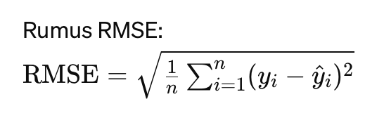
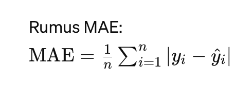
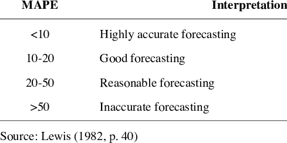

# California-Housing-Price-Caps3

## **Context**
California adalah sebuah negara bagian di Barat Amerika Serikat, terletak di sepanjang Pantai Pasifik Amerika dengan ibu kotanya adalah Sacramento. Pada tahun 2020, populasi California diperkirakan sekitar 39,5 juta orang, menjadikannya salah satu negara bagian paling padat penduduk di AS. Negara bagian ini mencakup luas wilayah 423.967 KM2. Kepadatan penduduk California sekitar 93,17 orang per KM2. Dari tahun 2010 hingga 2020, California mengalami peningkatan populasi sebesar 5,8%, yang setara dengan sekitar 2,4 juta penduduk tambahan.

Nilai suatu rumah sangat penting dalam menentukan status sosial masyarakat. Sebagai contohnya, dalam pengajuan kredit, nilai rumah tersebut menjadi acuan dalam nominal kredit yang dapat diberikan. Penilaian rumah atau apraisal biasanya dilakukan pada tahap analisa kredit. Dalam beberapa analisa kredit, apraisal rumah dilakukan oleh penilai kompeten. Dalam konteks pengajuan kredit, bank akan melakukan penaksiran atas nilai rumah yang akan dijadikan agunan. Terdapat dua pendekatan dalam menghitung nilai appraisal properti:

- Pendekatan Harga Pasar: Bank membandingkan rumah yang akan dijadikan agunan dengan tiga sampel rumah yang memiliki spesifikasi serupa. Rumah-rumah tersebut biasanya berasal dari wilayah yang sama. 
- Pendekatan Nilai Taksir Rumah: Pendekatan ini memperhitungkan biaya pembangunan dan depresiasi. Nilai taksir rumah dihitung berdasarkan biaya pembangunan dan nilai depresiasi. 

## **Problem Statement**

Nilai appraisal rumah amatlah sangat penting bagi bank, mengingat hal tersebut akan dijadikan dasar dalam pemberian kredit. Apabila nilai apraisal under dari harga market tentu bank mengalami risiko kredit, sedangkan apabila nilai appraisal lebih dari harga pasar dari sisi bank tidak mengalami risiko, namun customer tentu bisa saja mengalami kerugian mengingat akan timbul biaya asuransi dan biaya notaris yang dikenakan dari nilai apraisal tersebut.

Tentunya kita memerlukan suatu model yang dapat menentukan suatu kewajaran rumah (appraisal) berdasarkan letak/posisi rumah, jumlah ruangan, jumlah kamar tidur, umur bangunan, populasi penduduk disekitar.

## **Goals**

Tujuan dari model machine learning California Housing Price ini adalah untuk penentuan harga rumah/ appraisal, dengan features lokasi perumahan, umur bangunan, jumlah ruangan, jumlah kamar tidur, populasi, dan pendapatan dari penghuni rumah dan apakah mampu untuk dibandingkan dengan pendekatan harga pasar. 

**Analytic Approach**

Pendekatan analitik yang akan kami gunakan adalah pendekatan prediktif menggunakan teknik machine learning, khususnya dalam supervise regressor. Kami akan menggunakan dataset yang ada untuk melatih model yang dapat memprediksi  nilai suatu rumah berdasarkan variabel yang ada dalam dataset. Langkah-langkah utama dalam pendekatan ini mencakup pemrosesan data untuk persiapan, pemilihan fitur, pemodelan dengan algoritma yang sesuai dengan benchmarking model, seperti Linear Regresion, KNN Regresor, Decision Tree Regressor, Random Forest, & XGBoost Regressor, dan melakukan validasi model menggunakan metrik evaluasi yang tepat, dan penyesuaian model jika diperlukan.

**Metric Evaluation**
Dalam evaluasi model machine learning ini kita akan menggunakan dua metriks yaitu : 

1. Root Mean Squared Error (RMSE)
    RMSE adalah akar kuadrat dari rata-rata kuadrat kesalahan. Ini memberikan penekanan yang lebih besar pada kesalahan yang lebih besar karena kesalahan dikuadratkan sebelum dirata-rata dan diakar. RMSE sering digunakan ketika kesalahan besar perlu mendapat perhatian lebih dalam evaluasi model.   
    
    

    Kapan menggunakan RMSE:
    1. Kesalahan Besar Lebih Penting: Jika kesalahan besar perlu diberi perhatian lebih (misalnya dalam aplikasi di mana kesalahan besar sangat berbahaya atau mahal), RMSE lebih cocok karena memberikan penalti yang lebih besar untuk kesalahan yang lebih besar.
    2. Model Evaluasi yang Lebih Ketat: RMSE dapat memberikan evaluasi yang lebih ketat terhadap model, karena menghukum kesalahan besar lebih keras. Ini bisa membantu dalam mendorong pengembangan model yang lebih presisi.
    3. Distribusi Normal dari Kesalahan: Jika residual Anda mengikuti distribusi normal, RMSE lebih sesuai karena sifat kuadratnya selaras dengan sifat distribusi normal dari kesalahan.

2. Mean Absolute Error (MAE)
    MAE adalah rata-rata dari selisih absolut antara nilai yang diprediksi oleh model dan nilai yang sebenarnya. Ini memberikan gambaran yang jelas tentang seberapa besar kesalahan rata-rata yang dibuat oleh model. MAE lebih mudah diinterpretasikan karena nilainya langsung terkait dengan unit dari data asli.

    

    Kapan menggunakan MAE:
    1. Kesalahan Seimbang: Jika Anda ingin memberikan bobot yang sama untuk semua kesalahan, maka MAE lebih cocok. MAE tidak mengeskalasi efek dari kesalahan besar, jadi lebih adil dalam memperlakukan semua jenis kesalahan secara sama.
    2. Robust Terhadap Outlier: MAE lebih robust terhadap outlier dibandingkan dengan RMSE karena tidak mengkuadratkan kesalahan. Jika data Anda memiliki outlier yang signifikan, MAE mungkin memberikan gambaran kinerja model yang lebih realistis.
    3. Interpretasi yang Sederhana: MAE lebih mudah diinterpretasikan karena satuan dari MAE sama dengan satuan dari variabel target, memberikan pandangan langsung tentang kesalahan prediksi rata-rata.

Namun dalam pengambilan keputusan kita akan menggunakan nilai MAE dan MAPE (percentage dari MAE) dengan pertimbangan nilai MAE lebih mudah untuk dilakukan intepretasi karna memiliki skala yang sama dengan variabel target dan memiliki outliers yang tinggi dari nilai residual.

Threshold nilai MAPE yang dikatakan baik sebagai berikut:

## **Conclusion**

Berdasarkan pemodelan yang sudah dilakukan beberapa kesimpulan yang dapat ditarik sebagai berikut: 

- Model XGBoost dengan parameter Learning Rate : 0.11, Max Depth : 7, N Estimators : 300, Subsample : 0.7 baik dalam meprediksi train dan test set, dengan nilai MAE dan MAPE berada dalam threshold *Good Forecasting*.

- Model tersebut baik dalam bekerja dalam rentang nilau rumah $107.259 sd $476.300 dengan nilai MAPE kurang dari 20%, sedangkan untuk nilai rumah kurang dari $107.259 nilai MAPE sebesar 24% atau $16.944.

- Features Importance dalam model ini adalah ocean proximity, dimana harga rumah Inland akan lebih murah dibanding harga rumah yang dekat dengan Pantai, nilai importance variabel tersebut mencakup 76,3%. Sedangkan variabel median income memiliki fitur importance 7,25%, population per household 2,89%, longitute sebesar 2,86%, dan latitude sebesar 2,83%. Kelima fitur ini sudah cukup untuk memodelkan prediksi harga rumah di CA sebesar 92,18%

- Model tersebut apabila diimplementasikan dengan harga rumah saat ini setelah memperhitungkan faktor inflasi selama tahun 1990 sd 2024 kurang relevan untuk diterapkan, dengan selisih nilai sekitar $320.765 atau 160,5%. Apabila model tersebut diterapkan dalam bisnis perbankan, bank akan memiliki potensi kerugian hingga $320.765 karna selisih nilai prediksi model dengan harga pasar. Bank selaku pemberi kredit dapat risiko kredit, karna nilai jaminan yang diberikan kurang harga pasar rumah tersebut.

## **Recomendation**

Hal-hal yang dapat dilakukan untuk mengembangkan model agar lebih baik lagi, seperti:

1. Hasil uji dataset train atau tes set setelah dilakukan tunning penurunan nilai eror pada metric evaluation belum signifikan. Dan untuk mendapatkan model yang lebih baik lagi, dalam pencarian hyper parameter dengan tunning dapat menggunakan grid search sehingga dapat menemukan parameter yang lebih optimal.

2. Dataset yang digunakan dalam model ini merupakan hasil sensus ditahun 1990, sehingga model yang dibuat kurang relevan digunakan untuk ditahun 2024.

3. Untuk membuat model yang lebih relevan agar menambahkan beberapa variabel/fitur yang dapat mendukung model prediksi harga seperti luas tanah, luas bangunan, lebar jalan, dengan penambahan variabel tersebut diharapkan mampu menggambarkan prediksi harga rumah dengan menggunakan harga pasar. 
